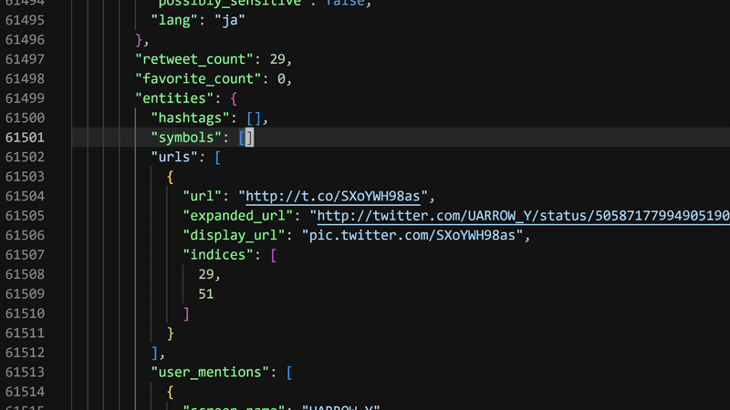

<!-- GENERATED FILE - update the templates in the xtask -->

# JJPWRGEM

JSON language server with rich error messages

## Requirements

Install `jjp`

```bash
mise use -g github:20jasper/jjpwrgem
```

See [releases](https://github.com/20jasper/JJPWRGEM/releases) for shell and PowerShell installation scripts, or
`npm install -g jjpwrgem`

## Features

LSP providing

- diagnostics
- code actions
- formatting

Scales well for large files. There is no perceivable delay when editing a 68k line, 5MB file. Diagnostics, code actions, and formatting take less than 20ms



[Diagnostics are calculated 2–3x faster and use 6–10x less RAM than VSCode's LSP](https://github.com/20jasper/JJPWRGEM/blob/main/benches/lsp/lsp.md)
