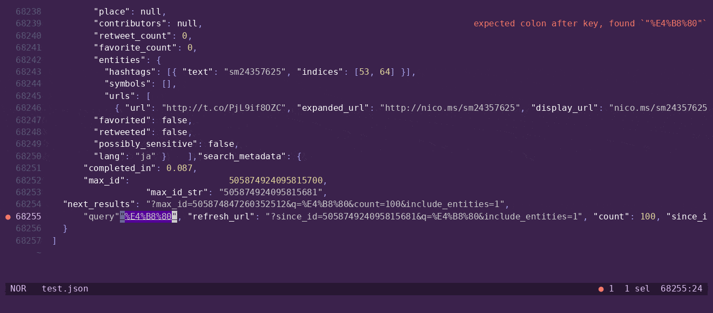

<!-- GENERATED FILE - update the templates in the xtask -->

# JJPWRGEM

JJPWRGEM JSON Parser With Really Good Error Messages

An RFC 8259 compliant JSON Parser and formatter!

```
$ echo -en "{\"coolKey\"}" | jjp check
error: expected colon after key, found `}`
 --> stdin:1:11
  |
1 | {"coolKey"}
  |  ---------^
  |  |
  |  expected due to `"coolKey"`
  |
help: insert colon and placeholder value
  |
1 | {"coolKey": "🐟🛹"}
  |           ++++++++

```

 [](https://codspeed.io/20jasper/JJPWRGEM?utm_source=badge)

## Why JJP?

- Rich errors with context, descriptions, and patches
- LSP reports diagnostics around 16-56x faster and uses 6-10x less RAM than VSCode's JSON LSP — [LSP benchmarks](./benches/lsp/README.md)
- Parses and pretty prints a 1.7MB file in ~11ms — [benchmarks](./benches/BENCHMARKS.md)




## Installation

### Precompiled

Precompiled x86-64 binaries require a CPU with AVX2 support (Intel Haswell 2013+, AMD Ryzen 2017+). ARM binaries have no special requirements

```bash
mise use -g github:20jasper/jjpwrgem
```

See [releases](https://github.com/20jasper/JJPWRGEM/releases) for shell and PowerShell installation scripts, or `npm install -g jjpwrgem`

### From source

```bash
RUSTFLAGS="-C target-cpu=native" cargo install --path .
```

### LSP

See [LSP setup](./crates/lsp/readme.md#quick-start) to configure your editor

## Stability

Internal libraries are likely unstable. Formatting output is unstable

## FAQ

### What does JJPWRGEM stand for?

JJPWRGEM JSON Parser With Really Good Error Messages. I was inspired by GNU to make a recursive acronym

### How do you pronounce JJPWRGEM?

/ˈdʒeɪ dʒeɪ ˈpaʊər dʒɛm/ JAY-jay-POW-er-jem

### But why is it called that?

It sounds cool and the name isn't taken on any package managers

### Is it blazingly fast™?

Axolotls can't walk so fast, so skateboards are pretty fast 🛹🐟

See the [benchmarks](/benches/BENCHMARKS.md)

### Why is the logo an axolotl riding a skateboard?

It's cool

### How long is an axolotl?

According to the San Diego zoo, "[a]n axolotl can reach 12 inches in length, but on average grows to about 9 inches[^axolotlFact]"

[^axolotlFact]: https://animals.sandiegozoo.org/animals/axolotl
